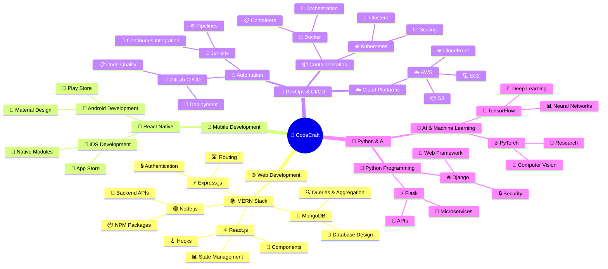

  
   
  <h1>⚡ CodeCraft-with-Abhinay ⚡</h1>
  <h3>🚀 Learn MERN, React Native, DevOps, CI/CD, Python & AI — code smarter with real projects and practical learning 🚀</h3>
  
  <!-- Technology Badges -->
  

    
    
    
    
  

  

    
    
    
    
  

  
  <!-- Stats Badges -->
  

    
    
    
  

---

## 🚀 About This Project

Welcome to **CodeCraft-with-Abhinay**! This repository is your gateway to mastering modern software development. We focus on hands-on, project-based learning to build your skills in full-stack web development, mobile app creation, system operations, and artificial intelligence.

Our goal is to help you move beyond tutorials and start building **real-world applications**. By focusing on practical learning and best practices, you'll not only write code but also understand the entire software development lifecycle.

---

### 💻 Tech Stacks

We work with powerful, in-demand technologies to ensure you're learning the most relevant skills.

| 🎯 Category | 🛠️ Core Technologies | 📊 Skill Level |
| :---: | :--- | :---: |
| **🌐 Web Development** |     | ⭐⭐⭐⭐⭐ |
| **📱 Mobile Development** |  | ⭐⭐⭐⭐ |
| **🔧 DevOps & CI/CD** |     | ⭐⭐⭐⭐ |
| **🤖 Backend & AI** |     | ⭐⭐⭐⭐⭐ |
| **🗄️ Databases** |   | ⭐⭐⭐⭐ |

---

### ✨ My Preferred Stack

  <h4>🏆 The MERN Stack - My Top Choice for Full-Stack Development</h4>
  
  

While all these technologies are valuable, my personal favorite and a great starting point for aspiring developers is the **MERN Stack**.

<table align="center">
<tr>
<td align="center" width="33%">

**🟢 JavaScript Everywhere**
 

 
Use a single language for both frontend and backend, simplifying learning and development.

</td>
<td align="center" width="33%">

**👥 Strong Community**
 

 
React.js has a massive community with rich ecosystem of libraries and tools.

</td>
<td align="center" width="33%">

**🎯 Versatility**
 

 
Perfect for everything from simple websites to complex web applications.

</td>
</tr>
</table>

---

### 🗺️ Roadmap: A Mind Map of Your Journey

  

This mind map outlines a logical progression through the tech stacks we'll cover. Think of it as a guide to your learning journey, with each branch representing a key area of focus.

---

## 🎯 Featured Projects & Learning Paths

  

### 🌟 Current Focus Areas

<table>
<tr>
<td align="center" width="25%">
  
    
  <h4>🌱 Getting Started</h4>
  
Perfect for newcomers to programming and web development

  <ul align="left">
    <li>HTML/CSS Fundamentals</li>
    <li>JavaScript Basics</li>
    <li>Git & GitHub</li>
    <li>Basic React Components</li>
  </ul>
</td>
<td align="center" width="25%">
  
    
  <h4>🚀 Building Skills</h4>
  
For developers ready to dive deeper into full-stack development

  <ul align="left">
    <li>Advanced React Patterns</li>
    <li>Node.js & Express APIs</li>
    <li>Database Integration</li>
    <li>Authentication Systems</li>
  </ul>
</td>
<td align="center" width="25%">
  
    
  <h4>⚡ Expert Level</h4>
  
Complex projects for experienced developers

  <ul align="left">
    <li>Microservices Architecture</li>
    <li>Docker & Kubernetes</li>
    <li>CI/CD Pipelines</li>
    <li>Performance Optimization</li>
  </ul>
</td>
<td align="center" width="25%">
  
    
  <h4>🤖 AI & Machine Learning</h4>
  
Cutting-edge AI and ML implementations

  <ul align="left">
    <li>TensorFlow Projects</li>
    <li>Computer Vision</li>
    <li>Natural Language Processing</li>
    <li>Deep Learning Models</li>
  </ul>
</td>
</tr>
</table>

---

## 🤝 Join Our Community

  <h3>🌟 Connect, Learn, and Grow Together 🌟</h3>
  
  

    
    
    
    
  

### 💡 How to Get Started

<table align="center">
<tr>
<td align="center" width="33%">
  <h4>1️⃣ Star This Repo</h4>
  
⭐ Show your support and bookmark this resource

</td>
<td align="center" width="33%">
  <h4>2️⃣ Choose Your Path</h4>
  
🛤️ Pick a learning track that matches your goals

</td>
<td align="center" width="33%">
  <h4>3️⃣ Start Building</h4>
  
🔨 Follow along with hands-on projects

</td>
</tr>
</table>

---

## 🏆 Achievement Badges

  <h3>🎖️ Unlock Your Coding Journey Milestones</h3>
  
  

    
    
    
  

  

    
    
    
  

---

## 🤝 Contributing

  

We welcome contributions from developers of all skill levels! Here's how you can help:

- 🐛 **Report bugs** or suggest improvements
- 📝 **Improve documentation** or add tutorials
- 💡 **Share project ideas** or learning resources
- 🔧 **Submit code improvements** or new features

### 📋 Contribution Guidelines

1. **Fork** the repository
2. **Create** a feature branch (`git checkout -b feature/amazing-feature`)
3. **Commit** your changes (`git commit -m 'Add some amazing feature'`)
4. **Push** to the branch (`git push origin feature/amazing-feature`)
5. **Open** a Pull Request

---

  <h2>🙏 Thank You for Visiting!</h2>
  

    <strong>Happy Coding! 🚀</strong> 
    Made with ❤️ by <strong>Abhinay Kushwah</strong>
  

  
  

    
    
  

  
  
<em>⭐ Don't forget to star this repository if you found it helpful!</em>

